

  

### G-Books

 A simple android app written in Kotlin to read books from the <a href="https://developers.google.com/books/docs/overview">Google Book Api</a>. 

---

## **Problem Statement**

During lockdown, students faced a lot of problem arranging books. So, they had to turn towards online material which included ebooks. Finding eBooks links lead to many scams/viruses/spam mails from different sites. Buying books from online sites is risky, tends to many frauds and it is not recommended.

## **Solution**

Using Google books API we have designed an app that opens desired books by the student by using a simple search mechanism. By using this method we are protected from any kind of scam/virus and the user is protected as Google books API is a trusted source for all ebooks. It has a wide library of of books which are included in syllabus. Nowadays it also has the option of audio books which will help students study from home. This will lead to saving of paper and other resources used to print books.

## **Screenshots**
### **Light**
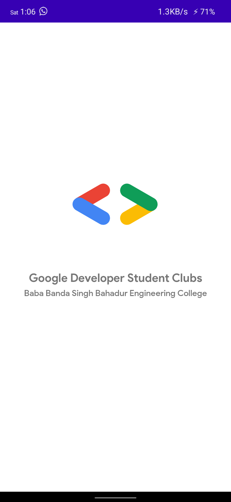 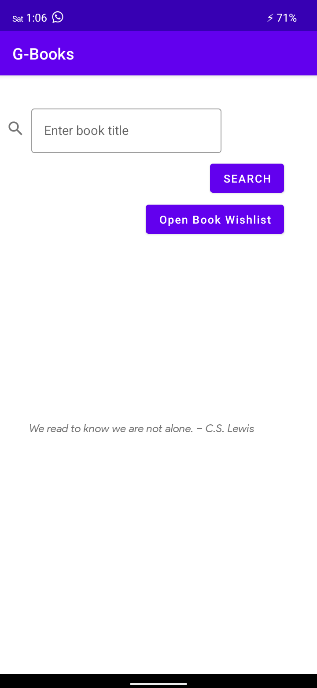 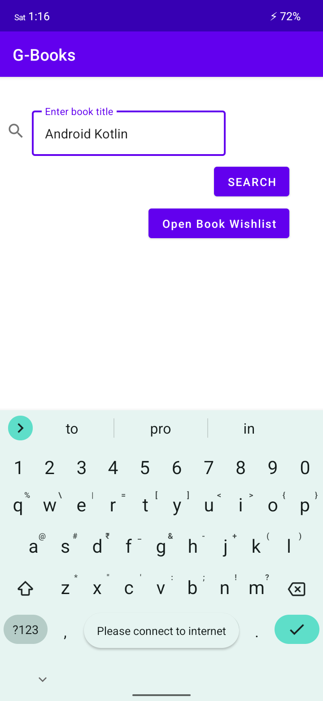 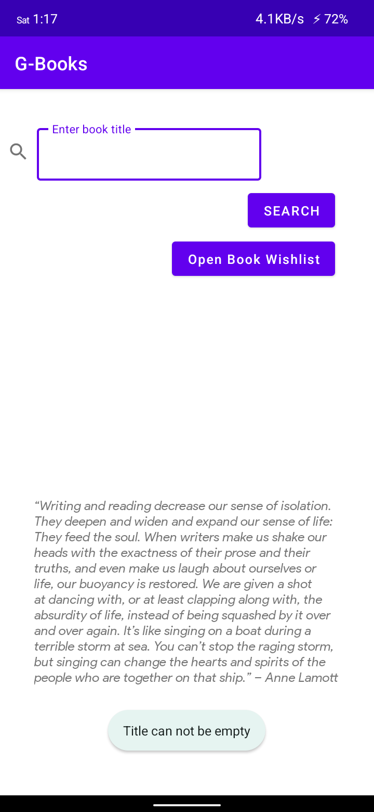
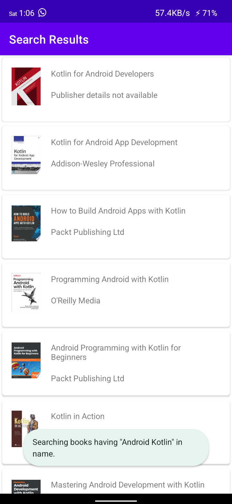 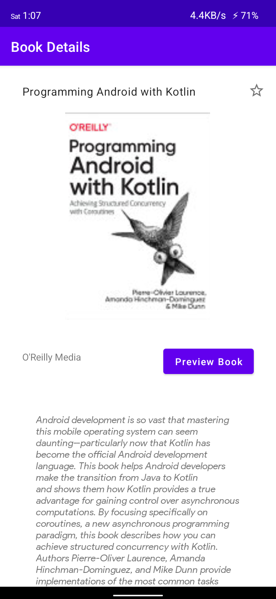 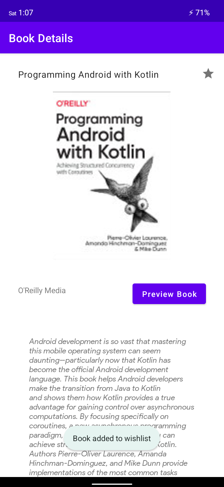 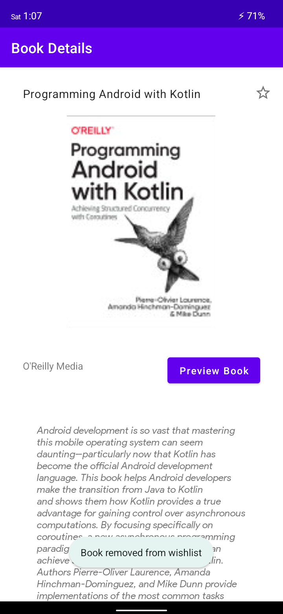 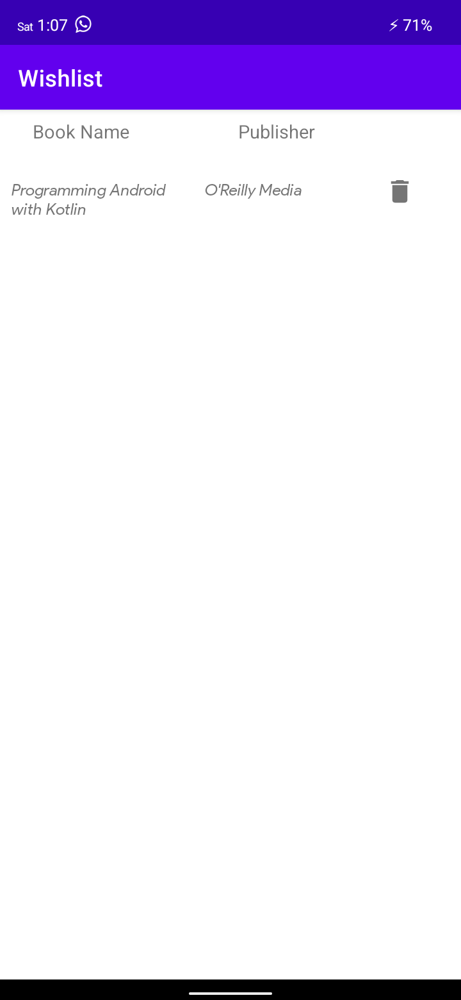
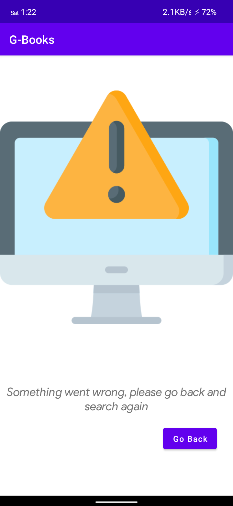

### **Dark**
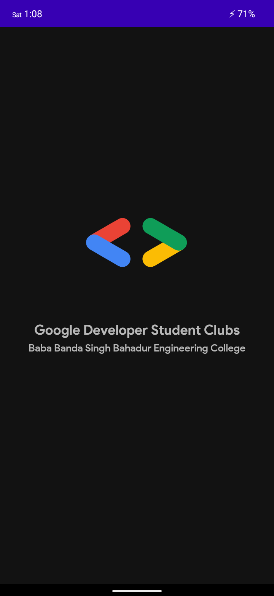 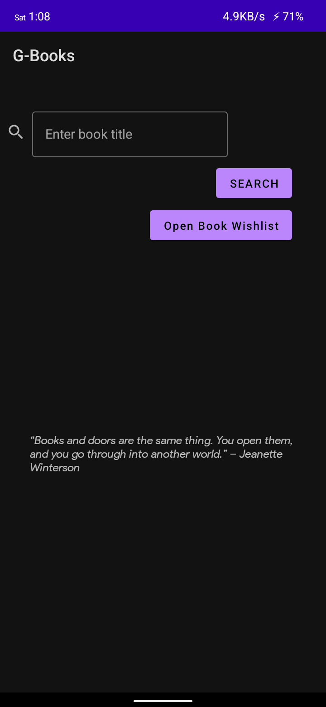 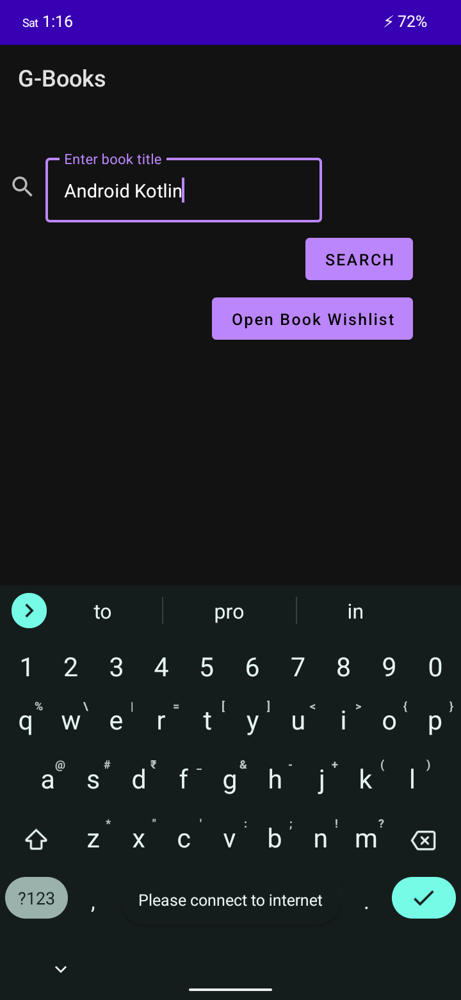 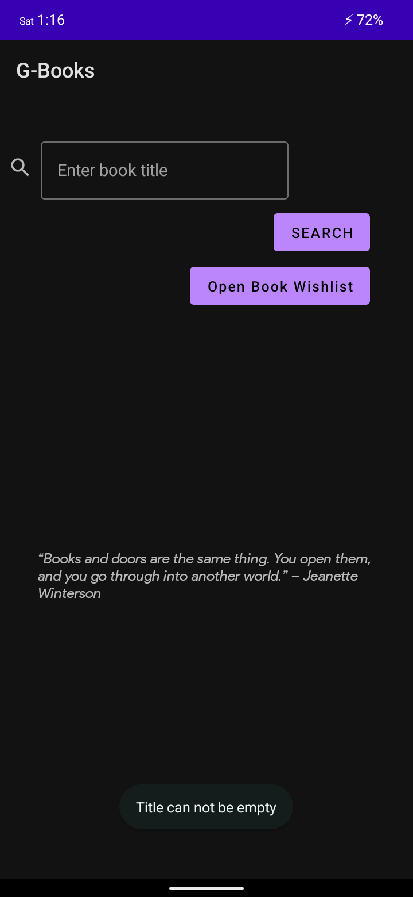
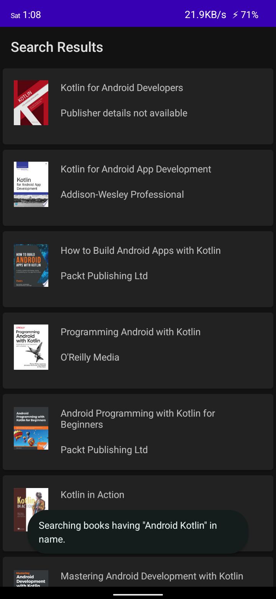 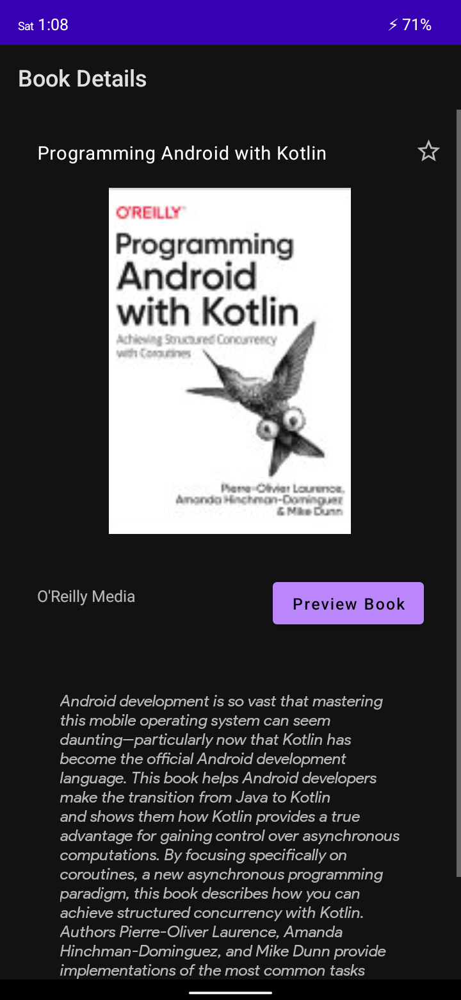 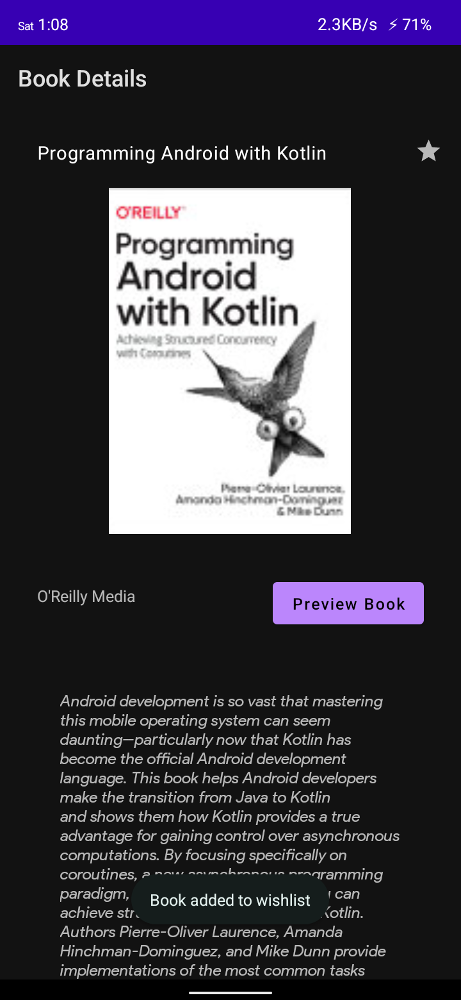 
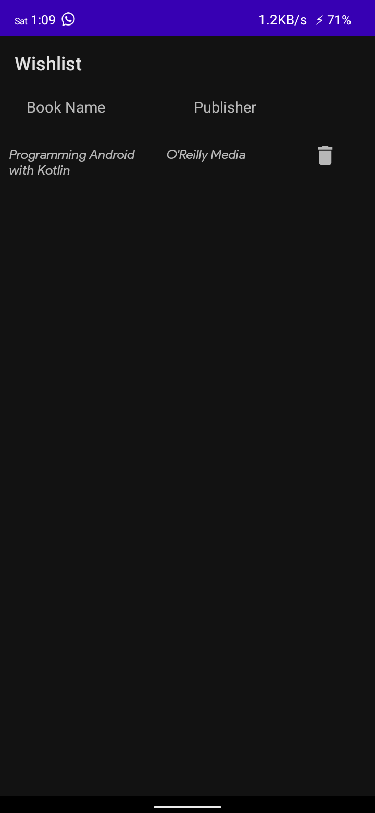 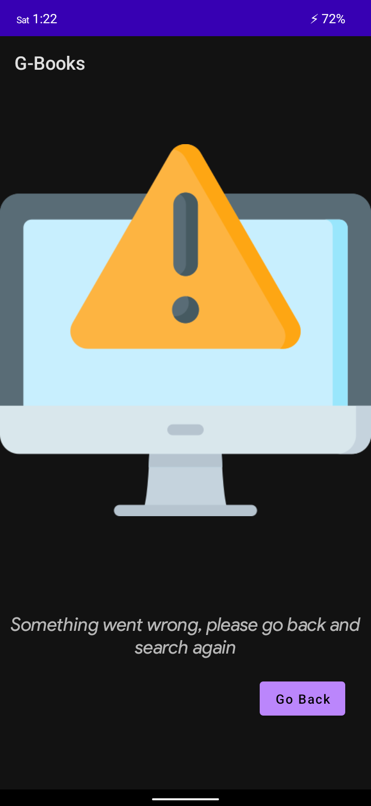

## **Functionality & Concepts used**

The App has a very simple and interactive interface which helps the students search their desired book and preview online. Following are few android concepts used to achieve the functionalities in app :

- `Constraint Layout` : All of the activities in the app uses a flexible constraint layout, which is easy to handle for different screen sizes.
- `Recyclerview` :  To present the list of different eBooks we used the efficient recyclerview. 
- `Google Books API` : We are also using the Google Books API free version.
- `LiveData & Room Database` : We are also using LiveData to update & observe any changes in the Books Wishlist and update it to local databases using Room.
- `Coil library` : Coil library is used to render thumbnail/book cover pages from their URL that we receive in the response.

## **Application Link & Future Scope**

The app is currently in the Alpha testing phase with BBSBEC campus with a limited no. of users. You can access the pre-release of our app from [releases](https://github.com/gdsc-bbsbec/GBooks/releases/) section.

Once the app is fully tested and functional in BBSBEC campus, we plan to talk to neighboring colleges also to propose this app idea and collaborate with them on this app. Also we are planning to host a github repository for wildcard entries of the eBooks, notes, study materials, magazines by teachers and students and the app will include the search results from that repo as well.
